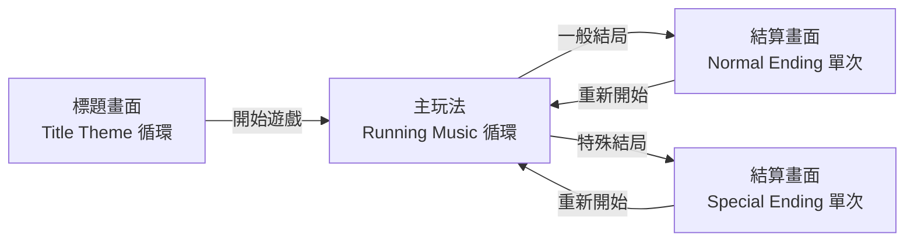

# 小草奔跑成長｜背景音樂播放規格

- **日期**：2026-10-03
- **狀態**：草案

## 1. 概述

遊戲全程只用 **4 首背景音樂**：2 首循環播放、2 首單次播放。任兩首切換時，一律用約 **400ms** 的交叉淡入淡出。

- **範圍**：這 4 首 BGM 的播放時機、循環方式和切換過渡。
- **不在範圍內**：音效（SFX）、環境音、選項畫面的額外配樂、音量設定 UI。本版**不新增第 5 首曲子**。
- **對象**：負責串接音樂的程式，以及準備音檔的成員。

## 2. 曲目清單

音檔已放在 `Assets/Music/`：

| 曲目 | 程式代碼 | 用途 | 播放模式 | 檔案 | 長度 |
| --- | --- | --- | --- | --- | --- |
| Title Theme | `Title` | 開場（標題畫面） | 循環 | `Assets/Music/Title Theme.mp3` | 2:50 |
| Ingame Running Music | `Running` | 主玩法進行中 | 循環 | `Assets/Music/Ingame Running Music.mp3` | 2:11 |
| Normal Ending Music | `NormalEnding` | 一般結局 | 單次 | `Assets/Music/Normal Ending Music.mp3` | 0:25 |
| Special Ending Music | `SpecialEnding` | 特殊結局 | 單次 | `Assets/Music/Special Ending Music.mp3` | 0:30 |

- 循環曲的音檔**本身**必須首尾無縫接合。這是素材的要求，程式不會另外處理接縫。
- 單次曲要有完整的結尾，不能只是從其他曲子裁一段下來。

## 3. 播放時機

音樂只在「畫面階段」改變時切換。一局之中的事件選擇、結果顯示等狀態**不換曲**。

對應 `RunController` 的 `Phase`：

| 遊戲狀態 | 播放曲目 | 說明 |
| --- | --- | --- |
| 標題畫面（尚未實作） | `Title` | 進入時開始，循環到離開標題畫面為止 |
| `Running` | `Running` | `StartRun()` 時切換 |
| `Choosing` | `Running`（繼續） | 不換曲、不重播、不改音量 |
| `Result` | `Running`（繼續） | 同上 |
| `DeadEnd` | `Running`（繼續） | 同上，等玩家確認 |
| `Ended`，`EndReason` 為 `NoAvailableOption`、`MoistureDepleted`、`MoistureSaturated` | `NormalEnding` | 在 `ShowGameOver()` 切換 |
| `Ended`，`EndReason` 為 `SpecialEnding`（選到 `endingTitleId` 非 0 的選項） | `SpecialEnding` | 同上 |
| `Ended` → 重新開始（`R` / 確認鍵） | `Running` | 呼叫 `StartRun()` 時切換 |

結局曲的切換點統一放在 `RunController.ShowGameOver()`，結局種類由 `engine.EndReason` 判斷。目前有兩條路徑會進到這裡：

- `DeadEnd` 時玩家確認（`ConfirmDeadEnd()`）。
- 結果畫面按繼續，而且這一局已結束（`Continue()` 裡 `engine.IsEnded` 為真）。濕度歸零、濕度滿、特殊結局都走這條。

補充規則：

- **單次曲播完之後**保持靜音，直到下一次切換。不循環，也不自動接回其他曲子。
- **快轉（按住 `Tab`）**不影響音樂：不變速、不變調。
- **一局中途**（`Running` ↔ `Choosing` ↔ `Result`）音樂不中斷、不從頭播放。

## 4. 切換過渡

| 項目 | 規格 |
| --- | --- |
| 過渡時間 | 400ms（可在 Inspector 調整，預設 0.4 秒） |
| 方式 | 交叉淡入淡出：舊曲音量 → 0，新曲 0 → 目標音量，兩者同時進行 |
| 新曲起點 | 一律從曲子開頭（0 秒）播放 |
| 計時基準 | 使用 unscaled time，不受 `Time.timeScale` 和快轉影響 |
| 從靜音開始 | 遊戲剛啟動、或單次曲已播完時，新曲直接淡入 400ms |
| 淡出完成後 | 舊曲 `Stop()`，釋放該 AudioSource |

大部分曲子開頭本身就有一段漸進的前奏，所以程式**只做 0.4 秒的交叉淡入淡出來銜接**：

- 新曲從 0 秒開始播，保留曲子自己的漸進前奏，不跳過。
- 程式不另外拉長淡入時間，也不額外加淡入曲線來配合前奏。

邊界情況：

1. **要求播放的就是正在播的曲子**：忽略，不重新播放，也不重新淡入。
2. **過渡進行到一半又要切換**：原本正在淡出的曲子立即停止；正在淡入的曲子改為從**目前音量**開始淡出；新曲用空出來的 AudioSource 淡入。總過渡時間仍是 400ms，同時最多只有 2 首在響。
3. **單次曲自然播完**：不做淡出（曲子本身已收尾），直接結束。

## 5. Unity 實作

### 架構

- 新增 `MusicPlayer`（MonoBehaviour），建議放在 `Assets/Game/Scripts/Audio/MusicPlayer.cs`，屬於 `GrassRun` assembly。
- `MusicPlayer` 是**被動的播放元件**：只提供 `Play(MusicCue cue)`，不讀遊戲狀態，也不判斷結局種類。
- 由 `RunController` 在狀態切換時呼叫 `musicPlayer.Play(...)`。這符合 `AGENTS.md` 的分層：Core（`RunEngine`）不認識音樂，View 不自行改狀態。
- 新增 `enum MusicCue { Title, Running, NormalEnding, SpecialEnding }`。

### MusicPlayer 欄位

| 欄位 | 型別 | 說明 |
| --- | --- | --- |
| `titleTheme`、`runningMusic`、`normalEnding`、`specialEnding` | `AudioClip` | 4 首曲子 |
| 各曲目標音量 | `float`（0–1） | 用來平衡 4 首的響度，預設 1 |
| `crossfadeSeconds` | `float` | 預設 0.4 |
| `outputGroup` | `AudioMixerGroup`（可留空） | 之後若加 AudioMixer，指到 Music 群組 |

- 內部用**兩個 AudioSource** 輪流使用（A/B），`playOnAwake = false`、`spatialBlend = 0`（2D）。
- `loop` 依曲目設定：`Title`、`Running` 為 `true`，兩首 Ending 為 `false`。

### 音檔與匯入設定

- 音檔維持在 `Assets/Music/`。目前 4 個 `.mp3` 還沒有 `.meta`，用 Unity 開啟專案匯入後，要把產生的 `.meta` 一起提交。
- 來源格式目前是 MP3（約 190kbps）。Unity 匯入時會依下表重新編碼。

| 匯入設定 | 值 |
| --- | --- |
| Load Type | Streaming |
| Compression Format | Vorbis，Quality 約 70 |
| Load In Background | 開啟 |
| Force To Mono | 關閉（音樂保留立體聲） |

### 場景

- 在 `Assets/Game/Scenes/Prototype.unity` 放一個 `Music` GameObject 掛上 `MusicPlayer`，並拖進 `RunController` 的欄位。
- 修改 `Prototype.unity` 前先跟其他成員確認，避免 YAML merge conflict。

## 6. 驗收標準

- [ ] 標題畫面播放 Title Theme，停留超過一首的長度後會無縫循環。
- [ ] 開始遊戲時，Title Theme 在約 400ms 內淡出，同時 Running Music 從頭淡入。
- [ ] 出現事件選項、顯示結果、全部選項鎖定時，Running Music 都不中斷、不重播。
- [ ] 按住 `Tab` 快轉時，音樂速度和音高不變。
- [ ] 一般結局切到 Normal Ending Music；特殊結局切到 Special Ending Music，切換都約 400ms。
- [ ] 結局曲播完後保持靜音，不循環。
- [ ] 在結算畫面按 `R` 重新開始，切回 Running Music 並從頭播放。
- [ ] 過渡途中連續觸發切換（例如結局曲淡入途中立刻按 `R`），沒有爆音、斷音，也不會有 3 首同時發聲。
- [ ] 4 首曲子的實際聽感響度大致一致。

## 7. 待確認事項

- [ ] **標題畫面還不存在**：目前 `RunController.Start()` 會直接呼叫 `StartRun()`。要先做標題畫面，Title Theme 才有地方播。
- [ ] **結算後重新開始要回哪裡**：本規格預設直接回到主玩法（播 Running Music），跟目前程式一致。如果之後改成回標題畫面，則改播 Title Theme。
- [ ] **結局曲的切換時機**：本規格預設在進入 `Ended`（顯示結算畫面）時切換。若希望在 `DeadEnd`（所有選項鎖定的當下）就先切，需要調整。
- [ ] **循環接縫**：MP3 編碼時常會在頭尾補一小段靜音，循環時可能聽到短暫空白。匯入後要試聽 Title Theme 和 Running Music 的接點；如果有空白，請作曲端重新輸出 WAV 或 OGG。另外，循環曲每次接回開頭都會再播一次漸進前奏，聽起來會有一段音量變小；如果覺得不自然，再討論是否改成循環時跳過前奏。
- [ ] **各曲目標音量**：在 Unity 裡試聽 4 首後再定。
